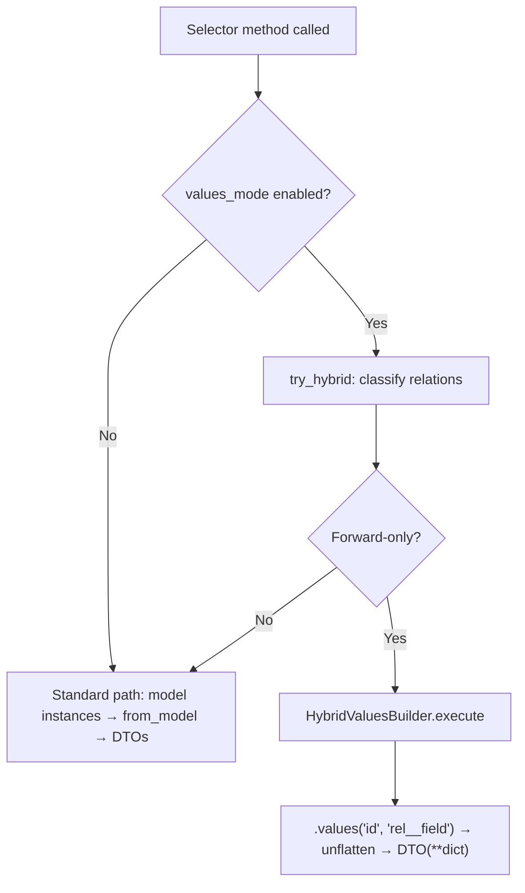

# Hybrid Values Mode

## Overview

Hybrid values mode bridges Django's fast `.values()` execution with `$expand` support for **forward relations** (ForeignKey, OneToOne). It provides the speed of `.values()` (2-5x faster than standard mode) while still returning nested DTOs.

| Mode | Speed | `$expand` | Returns |
|------|-------|-----------|---------|
| **Standard** | Baseline | Full (forward + reverse) | DTOs via `from_model()` |
| **Values** | 2-5x faster | None | Raw dicts |
| **Hybrid** | 2-5x faster | Forward only | DTOs via `DTO(**dict)` |

## How It Works

### Pipeline Comparison

Standard mode:
```
SQL → Model.__init__() → from_model() traversal → DTO → Serializer
```

Hybrid mode:
```
SQL → .values() dict → unflatten → DTO(**dict) → Serializer
```

The key insight: Django's `.values()` with `select_related` can fetch related fields using `__` notation:

```python
qs.select_related('author').values('id', 'title', 'author__id', 'author__name')
# → {'id': 1, 'title': 'My Post', 'author__id': 5, 'author__name': 'John'}
```

The `HybridValuesBuilder` collects these flattened fields, executes the query, then reconstructs nested DTOs from the flat dict.

### Execution Flow



1. **Classify relations** — `HybridValuesBuilder.classify_relations()` splits `$expand` into forward (FK/O2O) and reverse (M2M/reverse FK).
2. **Guard** — If any reverse relations exist, hybrid returns `None` and the selector falls back to standard mode.
3. **Collect fields** — Build the `.values()` field list including `relation__field` entries.
4. **Query** — `select_related()` + `.values()` + pagination in a single SQL query.
5. **Unflatten** — Flat dict → nested dict → `DTO(**dict)` with nested DTOs.

## Configuration

### The `values_mode` Meta Option

Each selector controls whether hybrid mode is enabled via the `values_mode` Meta option:

```python
class BlogPostSelector(ODataSelector):
    class Meta:
        model = BlogPost
        dto_class = BlogPostDTO
        values_mode = False  # Disable hybrid — DTOs use @property fields
        expandable_fields = {
            'author': AuthorDTO,
        }
```

| `values_mode` | Default | Behavior |
|---------------|---------|----------|
| `True` | Yes | Uses hybrid for forward expands, `.values()` for no-expand queries |
| `False` | — | Always uses standard mode (model instantiation + `from_model()`) |

### When to Set `values_mode = False`

Set it to `False` when your DTO includes `@property` fields that require model instantiation:

```python
# Model with @property
class Author(models.Model):
    user = models.OneToOneField(User, on_delete=models.CASCADE)
    bio = models.TextField()

    @property
    def name(self):
        return self.user.get_full_name()

    @property
    def email(self):
        return self.user.email

# DTO includes @property fields
@dataclass
class AuthorDTO(BaseODataDTO):
    id: int = UNSET
    bio: str = UNSET
    name: str = UNSET   # @property — can't be fetched via .values()
    email: str = UNSET   # @property — can't be fetched via .values()
```

In hybrid mode, `@property` fields are left as `UNSET` — the builder's `get_field_safe()` skips them because they're not database columns. If you need these fields populated, set `values_mode = False`.

### Using Summary DTOs for Performance

Create a slim DTO with only database fields to enable hybrid mode for expands:

```python
@dataclass
class BlogPostSummaryDTO(BaseODataDTO):
    """DB-only fields — enables hybrid values mode."""
    id: int = UNSET
    title: str = UNSET
    slug: str = UNSET
    status: str = UNSET

class CommentSelector(ODataSelector):
    class Meta:
        model = Comment
        dto_class = CommentDTO
        expandable_fields = {
            'post': BlogPostSummaryDTO,  # DB fields only → hybrid works
        }
```

## API: `try_hybrid()`

The `DjangoExecutor.try_hybrid()` method is the entry point:

```python
def try_hybrid(
    self,
    queryset: QuerySet,
    intent: QueryIntent,
    dto_class: type | None = None,
) -> list | None:
```

- **Returns** `list[DTO]` when hybrid mode applies (forward-only expands).
- **Returns** `None` when it doesn't apply (no expand, reverse relations, no dto_class).

All four selector methods use the same pattern:

```python
if self.values_mode:
    hybrid = self._executor.try_hybrid(base_queryset, intent, self.dto_class)
    if hybrid is not None:
        return hybrid

# Fallback to standard path...
```

## Relation Types

| Relation | Hybrid Support | Reason |
|----------|---------------|--------|
| **ForeignKey** | Yes | `select_related` → JOIN → `.values('rel__field')` |
| **OneToOneField** | Yes | Same as FK |
| **Reverse FK** | No → fallback | Requires `prefetch_related` (separate query) |
| **ManyToManyField** | No → fallback | Requires `prefetch_related` (separate query) |

## UNSET and NULL Handling

### UNSET

Fields not requested via `$select` get the `UNSET` sentinel (the dataclass default). The serializer skips them:

```python
# $select=id,title → .values('id', 'title')
dto = BlogPostDTO(id=1, title='My Post')
# dto.content = UNSET → serializer omits it
```

### NULL FK

When a FK is NULL, `.values()` returns `None` for all related fields. The builder detects this and sets the relation to `None`:

```python
# Post with no author
{'id': 2, 'title': 'Orphan', 'author__id': None, 'author__name': None}
# → dto.author = None  (not AuthorDTO(id=None, name=None))
```

## Architecture

### Module Structure

```
fc_selector/django/
├── executor.py                  # try_hybrid() entry point
├── hybrid_values_builder.py     # All hybrid logic
└── selector/
    └── odata_selector.py        # values_mode gating
```

### Responsibilities

| Component | Responsibility |
|-----------|---------------|
| `DjangoExecutor.try_hybrid()` | Classify relations, guard check, delegate to builder |
| `HybridValuesBuilder` | Field collection, `.values()` query, unflatten, DTO instantiation |
| `ODataSelector` | Gate hybrid via `values_mode`, fallback to standard path |
| `DjangoExecutor.execute()` | Standard path — always returns `QuerySet` |

### Key Functions Used

| Function | Location | Purpose |
|----------|----------|---------|
| `is_forward_relation()` | `django/utils/introspection.py` | Classify FK/O2O vs reverse |
| `get_field_safe()` | `django/utils/introspection.py` | Safe field lookup (skips @property) |
| `resolve_field_alias()` | `django/utils/aliases.py` | Resolve API name → DB field |
| `get_dto_fields()` | `core/dtos/utils.py` | Get DTO field names |
| `BaseODataDTO._get_relationship_info()` | `core/dtos/base.py` | Detect DTO relationship fields |
