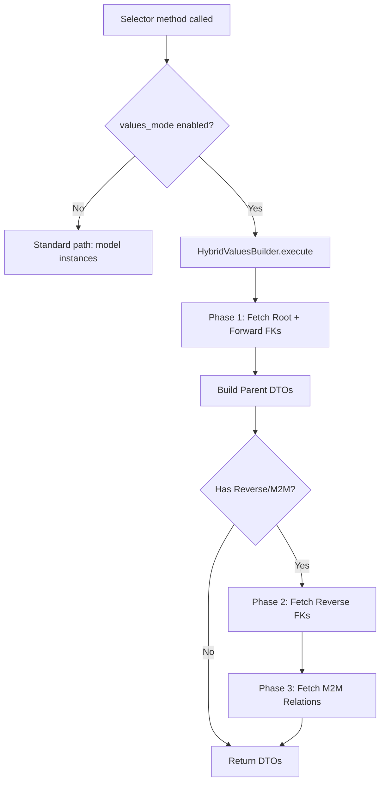

# Hybrid Values Mode

## Overview

Hybrid values mode bridges Django's fast `.values()` execution with `$expand` support for **all relation types** (Forward FK, Reverse FK, ManyToMany). It provides the speed of `.values()` (2-5x faster than standard mode) while still returning nested DTOs.

| Mode | Speed | `$expand` | Returns |
|------|-------|-----------|---------|
| **Standard** | Baseline | Full (forward + reverse) | DTOs via `from_model()` |
| **Values** | 2-5x faster | None | Raw dicts |
| **Hybrid** | 2-5x faster | **Full (forward + reverse)** | DTOs via `DTO(**dict)` |

## How It Works

### Strategy: 1+N Queries

The hybrid builder uses a **1+N queries** strategy to avoid Cartesian product explosion while maintaining high performance:

1.  **Root + Forward Relations (1 Query)**:
    -   Uses `select_related()` + `.values()` to fetch the root model and all forward FK/OneToOne fields in a single query.
    -   Flattened fields (e.g., `author__name`) are automatically unflattened into nested DTOs.

2.  **Reverse FK Relations (1 Query per relation)**:
    -   Fetches child objects in a separate query, filtered by `parent_pk__in=[...]`.
    -   Uses `.values()` for the child query as well.
    -   In-memory grouping attaches children to parents.

3.  **ManyToMany Relations (2 Queries per relation)**:
    -   **Query 1**: Fetches the "through" table to map Parent PKs ↔ Child PKs.
    -   **Query 2**: Fetches the child objects via `.values()`.
    -   In-memory grouping attaches children to parents.

### Pipeline Comparison

Standard mode:
```
SQL (JOINs) → Model.__init__() → from_model() traversal → DTO → Serializer
```

Hybrid mode:
```
SQL 1 (Root) → .values() dict → unflatten → DTO
SQL 2 (Child) → .values() dict → unflatten → Attach to Parent DTO
...
```

### Execution Flow



## Configuration

### The `values_mode` Meta Option

Each selector controls whether hybrid mode is enabled via the `values_mode` Meta option:

```python
class BlogPostSelector(ODataSelector):
    class Meta:
        model = BlogPost
        dto_class = BlogPostDTO
        values_mode = True   # Enable hybrid mode (default)
        expandable_fields = {
            'author': AuthorDTO,       # Forward FK
            'comments': CommentDTO,    # Reverse FK
            'tags': TagDTO,            # M2M
        }
```

### When to Set `values_mode = False`

Set it to `False` when your DTO includes `@property` fields or custom model methods that require full model instantiation:

```python
# Model with @property
class Author(models.Model):
    @property
    def full_name(self):
        return f"{self.first_name} {self.last_name}"

# DTO
@dataclass
class AuthorDTO(BaseODataDTO):
    full_name: str = UNSET   # @property — can't be fetched via .values()
```

In hybrid mode, `@property` fields are left as `UNSET`.

## Recursive Nesting

Hybrid mode supports recursive nesting up to `MAX_DTO_RECURSION_DEPTH` (default 10).

Example: `$expand=comments($expand=replies($expand=author))`

1.  **Query 1**: Blog Posts (Root)
2.  **Query 2**: Comments (Reverse FK for Posts)
3.  **Query 3**: Replies (Reverse FK for Comments)
4.  **Query 4**: Authors (Forward FK for Replies - joined in Query 3 via `select_related`)

## Nested Pagination

Pagination (`$top`, `$skip`) inside a reverse relation `$expand` is applied **globally** to the child query, not per-parent.

**Example**: `$expand=comments($top=5)`
-   **Standard Mode**: Returns top 5 comments *per post* (if using `Prefetch` with window functions, otherwise usually ignores it or applies globally).
-   **Hybrid Mode**: Returns top 5 comments *total* across all expanded posts.

*Limit*: This is a known limitation of the `.values()` approach. If you need strict per-parent limits, consider using custom loaders or standard mode with window functions.

## Relation Types Support

| Relation | Hybrid Support | Strategy |
|----------|---------------|----------|
| **ForeignKey** | ✅ Yes | `select_related` → JOIN → `.values('rel__field')` |
| **OneToOneField** | ✅ Yes | Same as FK |
| **Reverse FK** | ✅ Yes | Extra query (`child_model.objects.filter(fk__in=parents)`) |
| **ManyToMany** | ✅ Yes | Two extra queries (Through table + Child table) |

## Performance Characteristics

| Scenario | Standard Mode | Hybrid Mode | Benefit |
|----------|---------------|-------------|---------|
| **Simple List** | 100ms | 20ms | **5x Faster** (No model init) |
| **Forward Expand** | 120ms | 25ms | **5x Faster** (Single query, no model init) |
| **Reverse Expand** | N+1 queries (lazy) or 2 queries (prefetch) | 2 queries | **Faster** (No model init for children) |
| **M2M Expand** | N+1 queries (lazy) or 2 queries (prefetch) | 3 queries | **Faster** (No model init for children) |

**Why 1+N?**
Using `LEFT OUTER JOIN` for reverse relations often leads to **row explosion** (Cartesian product), where the parent data is duplicated for every child row. This massively increases data transfer and parsing time.

The **1+N strategy** fetches parents once, then fetches children in bulk. This is almost always more efficient for APIs returning nested collections.