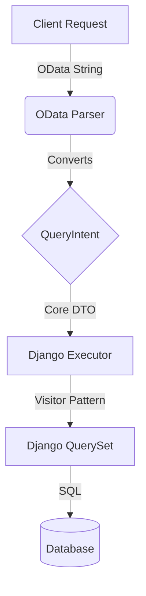

# Project Architecture

FC Selector follows the principles of **Hexagonal Architecture (Ports & Adapters)** to decouple business logic (data selection) from external protocols (OData) and persistence infrastructure (Django ORM).

## Overview

The system is divided into three main layers:

1.  **Protocol Layer (Input):** Handles parsing of external requests (e.g., OData String).
2.  **Core Layer (Domain):** Defines the query intent (`QueryIntent`) and data structures (`DTOs`, `AST`). It's pure Python with no framework dependencies.
3.  **Infrastructure Layer (Output):** Executes the query against the database (`DjangoExecutor`).

### Data Flow



## Key Components

### 1. Core (`fc_selector/core`)
The system's heart. No external dependencies (neither Django nor DRF).

*   **QueryIntent (`core.intent`):** The canonical object representing "what the user wants". Contains filters, field selection, ordering, and pagination in a protocol-agnostic way.
*   **AST (`core.ast`):** Abstract Syntax Tree to represent complex filter expressions (AND, OR, functions...).
*   **QueryBuilder (`core.query_builder`):** Fluent API to build `QueryIntent` programmatically. Supports dependency injection of custom filter parsers.
*   **Exceptions (`core.exceptions`):** Domain errors (e.g., `FieldNotFoundError`, `InvalidFieldError`, `TypeMismatchError`).

### 2. Protocol: OData (`fc_selector/protocols/odata`)
Acts as an input adapter.

*   **Parsers:** Convert OData strings (`$filter=name eq 'X'`) into Core AST objects.
    *   Uses **thread-local caching** to reuse lexer/parser instances for better performance.
    *   Validates maximum filter length (`MAX_FILTER_LENGTH=4000`) to prevent DoS attacks.
*   **Converters:** Transform OData-specific structures into a clean `QueryIntent`.

### 3. Infrastructure: Django (`fc_selector/django`)
Acts as an output adapter (backend).

*   **DjangoExecutor (`django.executor`):** The execution brain. Receives a `QueryIntent` and applies necessary transformations to the `QuerySet` recursively.
    *   Handles `filter()` using Visitors.
    *   Handles `select_related` and `prefetch_related` automatically to avoid N+1 problems.
    *   Handles `only()` to optimize field loading.
    *   `try_hybrid()` — attempts hybrid values mode for forward-only `$expand`, returning DTOs directly.
    *   `execute()` — standard path, always returns a `QuerySet`.
*   **HybridValuesBuilder (`django.hybrid_values_builder`):** Executes queries using `.values()` with `$expand` support for all relation types (Forward/Reverse FK, M2M). Collects flattened `__` fields for forward relations and executes separate queries for reverse/M2M relations, then reconstructs nested DTOs.
*   **AstToDjangoQVisitor (`django.visitors`):** Translates AST nodes (e.g., `Eq`, `Contains`) to Django `Q` objects. Includes field validation for security.
*   **ODataSelector (`django.selector`):** The public facade that developers use. Coordinates parsing and execution. Controls execution path via `values_mode` Meta option.
*   **Introspection Utilities (`django.utils.introspection`):** Safe model field access helpers like `get_field_safe()`, `is_forward_relation()`.

## Security

The system implements several security measures:

### Field Validation
*   **Private field blocking:** Fields starting with `_` are automatically blocked.
*   **Field existence validation:** Invalid field names raise `InvalidFieldError`.
*   **Allowed fields whitelist:** Optional set of allowed fields for fine-grained control.

### Input Validation
*   **Filter length limit:** Expressions exceeding `MAX_FILTER_LENGTH` are rejected.
*   **Type-safe parsing:** Strong typing prevents injection attacks.

## Performance

### Parser Caching
*   Thread-local storage for lexer/parser instances.
*   Avoids repeated instantiation overhead on each request.

### Query Optimization
*   Automatic `select_related` for forward relations.
*   Automatic `prefetch_related` for reverse/many relations.
*   `only()` to fetch only requested fields.

### Hybrid Values Mode
*   Uses `.values()` with `__` notation for forward FK/OneToOne expands — 2-5x faster than standard mode.
*   Uses 1+N query strategy for reverse FK/M2M relations — faster than model instantiation.
*   Controlled per-selector via `values_mode` Meta option (default: `True`).
*   Falls back to standard mode only when `values_mode = False`.
*   See [Hybrid Values Mode](HYBRID_VALUES_EXPAND.md) for details.

## Extensibility

This architecture allows:

*   **Protocol Swap:** We could implement a GraphQL parser that generates a `QueryIntent`, and the entire system would work without backend changes.
*   **Backend Swap:** We could create a `SqlAlchemyExecutor` that takes the same `QueryIntent` and executes it against another ORM.
*   **Parser Injection:** The `QueryBuilder` accepts custom filter parsers via dependency injection.

## Error Handling

Exceptions are managed from inside out:
1.  **Executor/Visitor:** Throws Core exceptions (`core.exceptions`).
2.  **Applier/Selector:** Catches Core exceptions and translates them to protocol exceptions (`ODataFilterError`) with appropriate HTTP error codes.

Exception hierarchy:
```
SelectorError (base)
├── QueryError
│   ├── FieldNotFoundError
│   ├── InvalidFieldError
│   ├── InvalidValueError
│   ├── TypeMismatchError
│   └── UnsupportedFunctionError
```
